# 多模态大模型与世界模型

## 目录
- 一、多模态从哪里开始
  - 多模态学习和应用
  - CLIP 图文对齐
- 二、从对齐到对话
  - Flamingo 的生成式方案
  - LLaVA 与开源模型
- 三、统一多模态模型
  - GPT-4V 和 GPT-4o
  - 视觉推理的新方向
- 四、世界模型
  - 从感知到模拟
  - 现状和挑战

## 一、多模态从哪里开始

### 多模态学习和应用

人类天然具有处理和整合多模态（Multimodal）信息的能力。我们在日常生活中，随时都在整合来自视觉、听觉、触觉以及语言等多感官通道的信息，以构建对外界环境的认知。

在人工智能的发展史中，早期的预训练大模型往往只在离散的纯文本空间中运行，相当于闭着眼睛感知世界。而多模态大语言模型（Multimodal Large Language Model, MLLM）的研究目标是打破单纯文本模态的约束，让 AI 能够像人类一样，联合理解文本、图像、音视频等多元异构信息。

为了让语言模型理解非文本模态，系统必须引入诸如视觉编码器（Vision Encoder）等组件，将高维度的原始图像或视频信号映射为特征向量，再将该特征投影到预训练语言模型的连续嵌入空间中，实现跨模态的统一表征与深入融合。

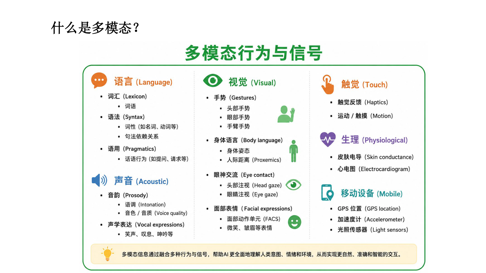

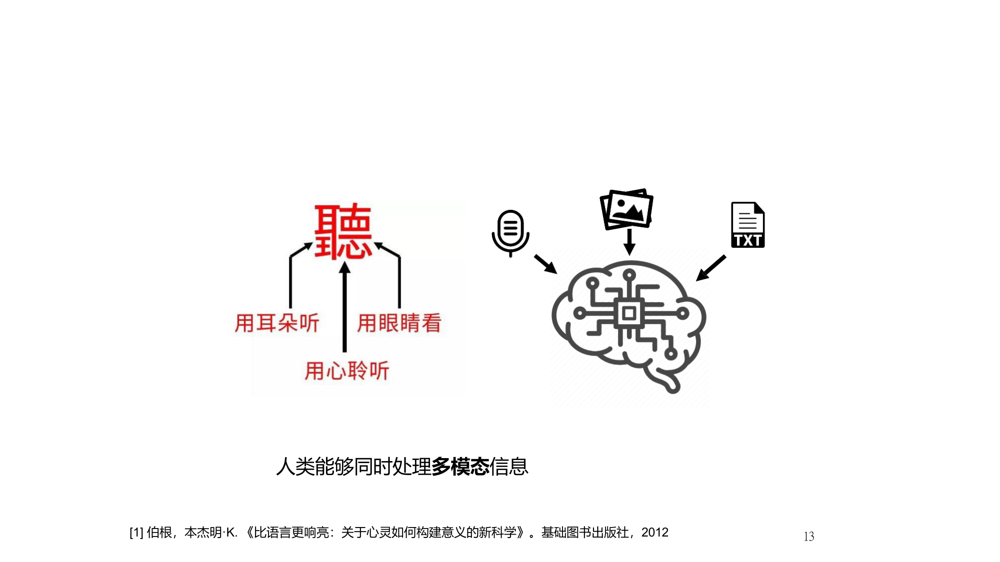

**典型应用场景**

图文联合建模和理解在多个行业有着巨大的落地价值：
* **医疗健康**：通过整合 CT/MRI 医学影像、电子病历文本描述以及病理组学数据，MLLM 能够完成更精准的多源联合临床会诊。
* **具身智能与机器人**：将外界摄像头的视觉反馈、语音命令与机器人的力觉传感相融合，指导机械臂完成柔性而复杂的作业任务。
* **新零售与电商**：借助图像和自由文本的多模态交叉匹配，显著提升以图搜图的语义召回率，赋能智能导购。

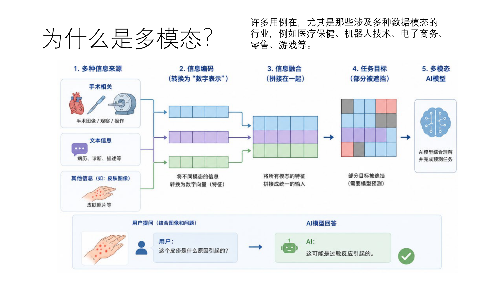

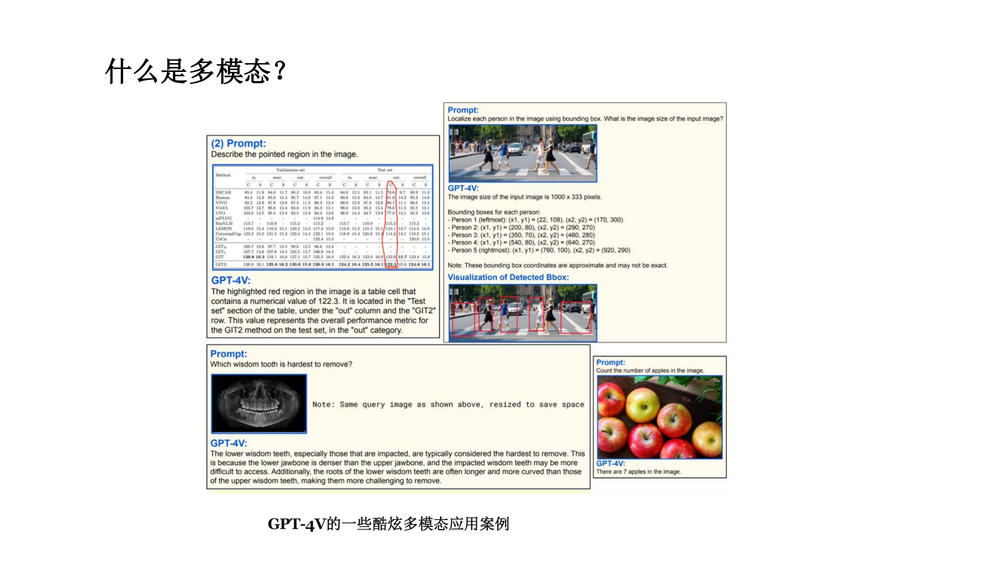

### CLIP 图文对齐

**双塔架构**

在多模态大模型出现之前，传统的计算机视觉模型（如 ImageNet 分类器）通常只能对特定的预定义类别集合进行预测，无法处理日常生活中无限且自由的文本查询。如何将非结构化的图像和开放的语言文字映射到同一个数学语义空间中，成为了实现通用视觉理解的必攻难关。

为此，OpenAI 于 2021 年提出了经典的 **CLIP (Contrastive Language-Image Pretraining)** 模型。它引入了极简的**双塔架构**：
* 一个图像编码器（Vision Encoder，如 ViT 或 ResNet）负责将图像映射为向量特征。
* 一个文本编码器（Text Encoder，基于 Transformer）负责将对应的描述文字映射为同等维度的向量。

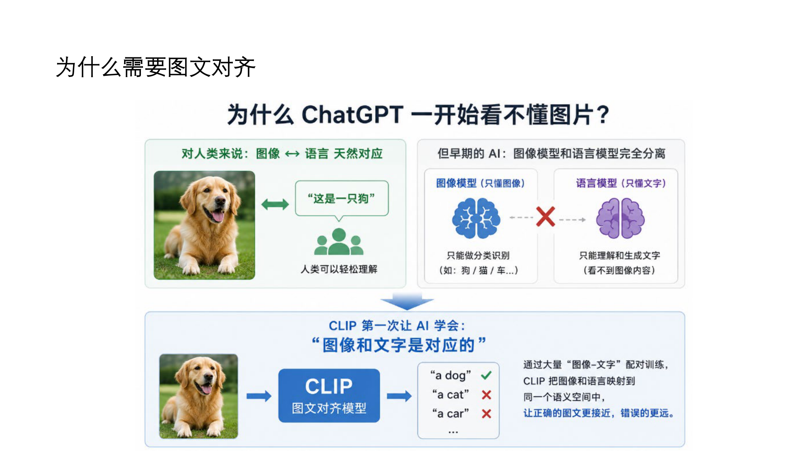

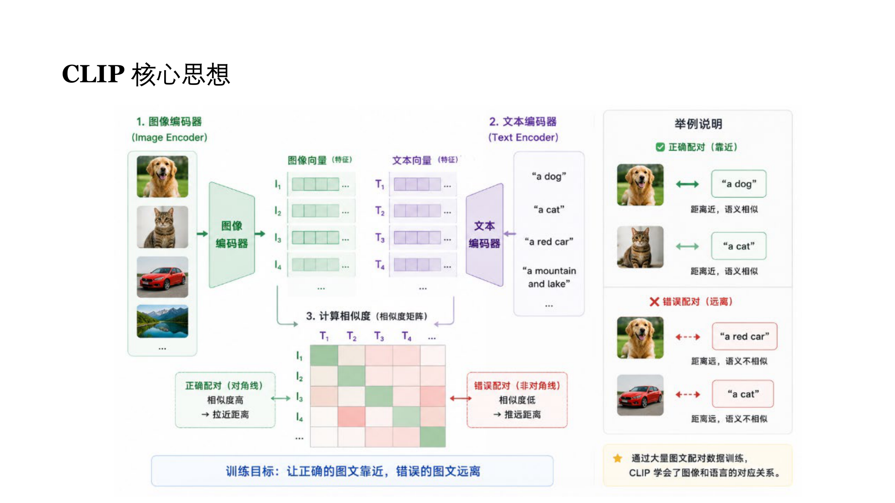

为了对齐这两个编码器，CLIP 采用了**对比学习（Contrastive Learning）** 目标：在包含了 4 亿对互联网图文的数据集上训练，最大化匹配图文对的向量余弦相似度，同时最小化不匹配图文对的相似度。这构建了一个联合的嵌入向量空间，使得语义一致的图片与文本在空间中距离相近。

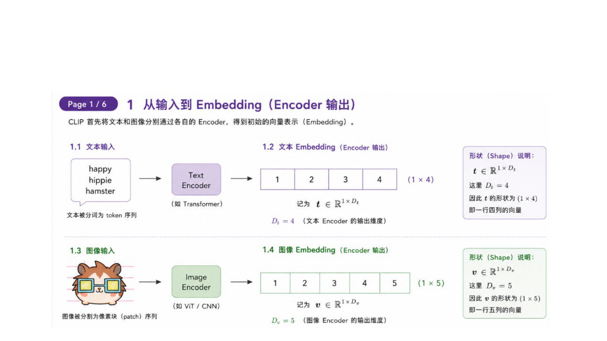

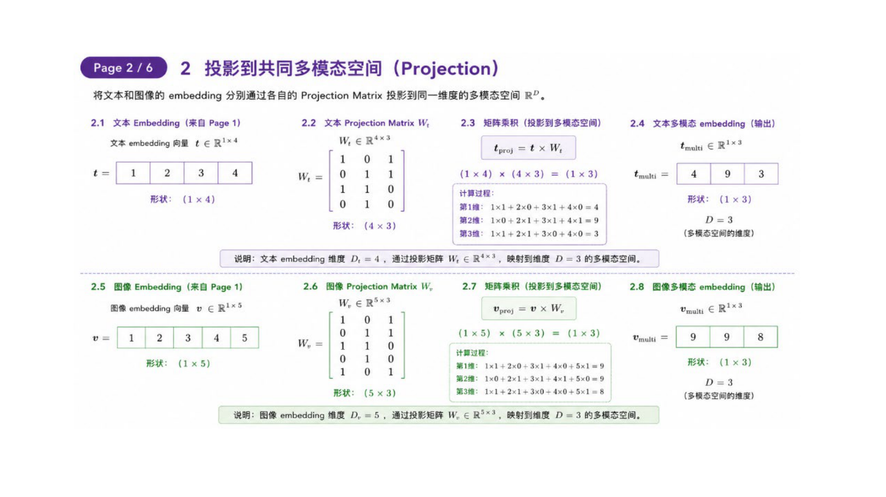

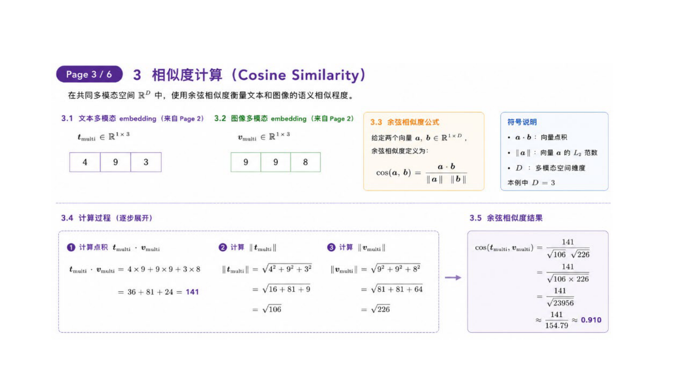

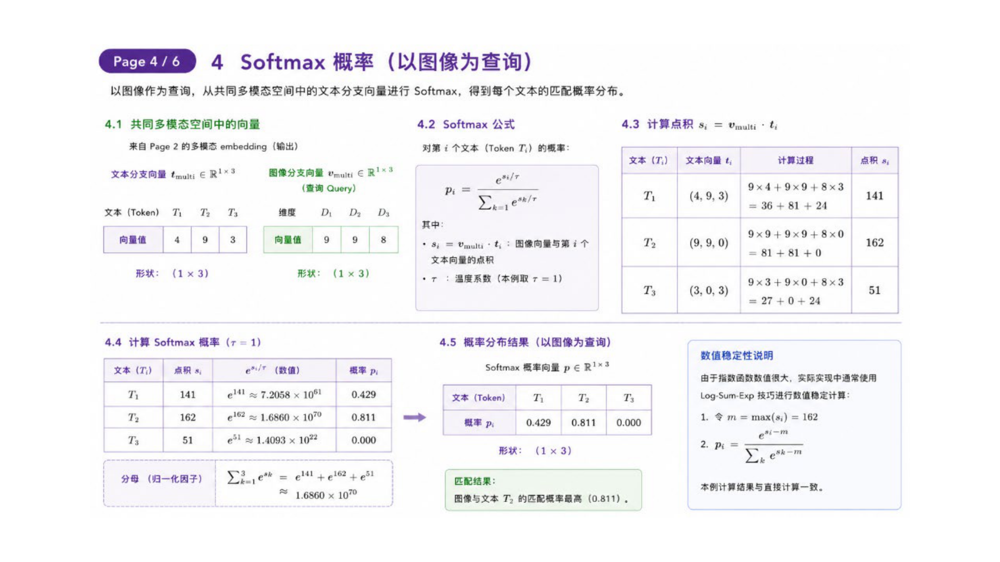

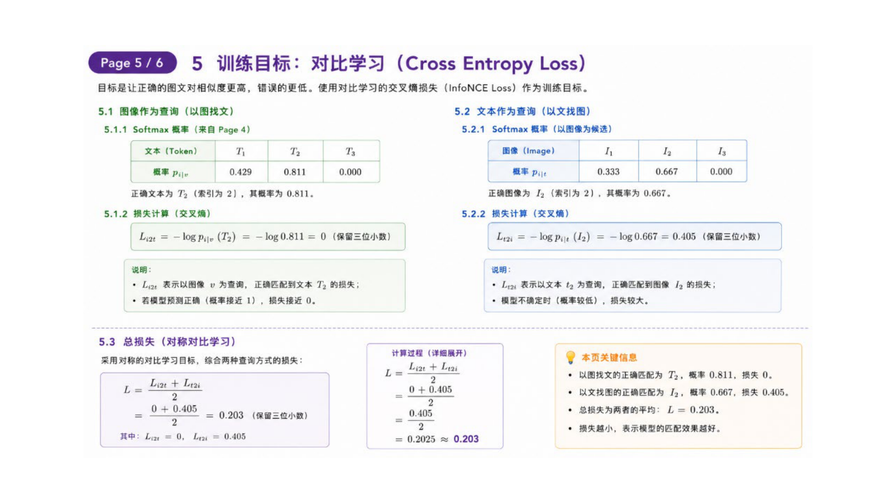

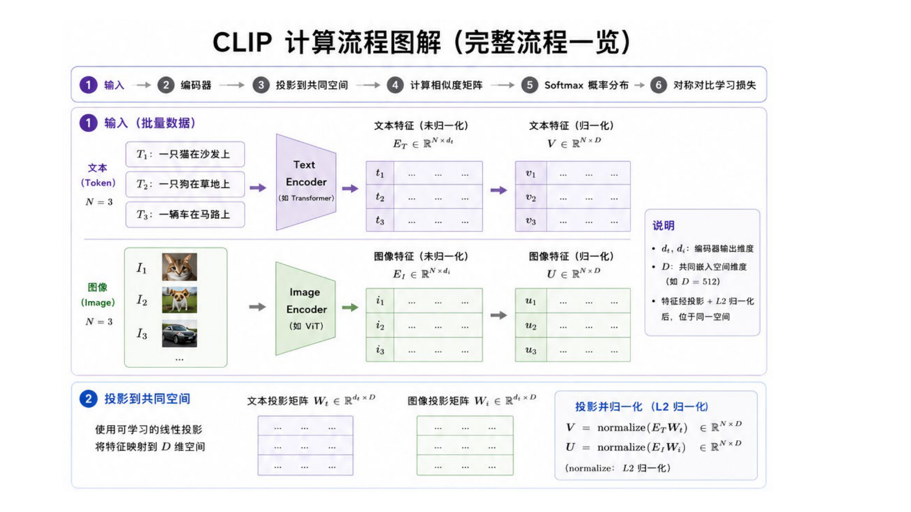

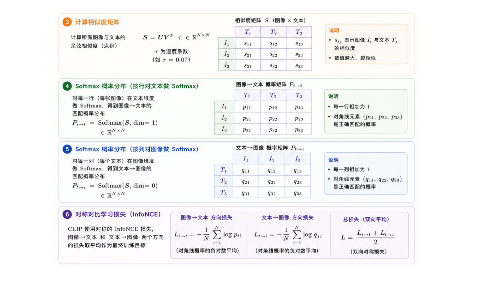

**零样本分类**

基于对比对齐的特性，CLIP 具有出色的 **Zero-shot（零样本）分类** 能力：

1. 面对需要预测的未知图像，直接把候选类名包装为文本模板（如“一幅 {类别名} 的照片”）。
2. 将这组候选文本通过文本塔转化为向量，同时把待测图片通过图像塔转化为向量。
3. 计算图片向量与所有候选类别文本向量的相似度得分，得分最高者即为分类答案。

这一方案完全抛弃了传统的微调流程，实现了强大的零样本泛化。也正因如此，CLIP 成为了文生图模型（如 Stable Diffusion）、多模态大模型（如 LLaVA）底层的标配视觉编码器。

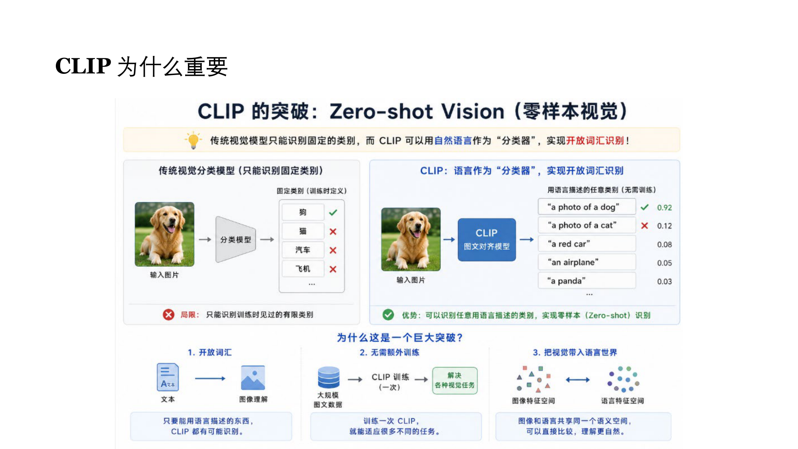

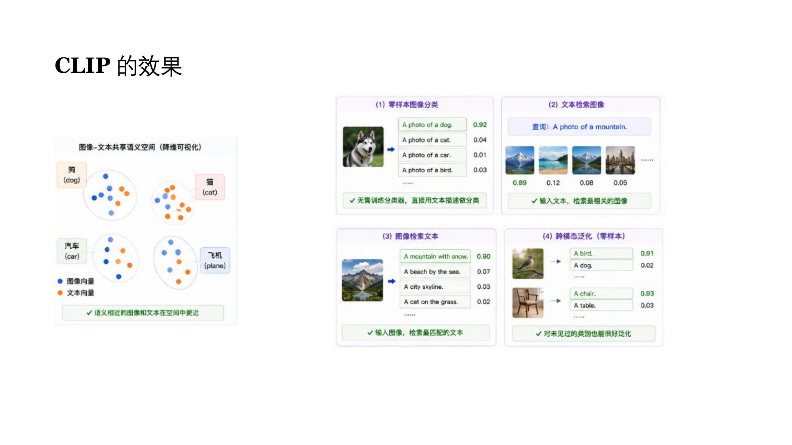

**CLIP 的局限**

虽然 CLIP 对齐了模态，但也存在不可调和的底层局限：
* **不具备生成能力**：双塔在完成对齐后，仅仅具备计算“图文相似度得分”的判别能力，无法自回归地输出一段人类语言来具体描述图片中复杂的故事情节。
* **模态融合程度浅**：图像和文本在计算之前都是各自独立前向传播的，中途没有进行深层的交叉融合，无法进行多步逻辑推理。
* **难以应对视觉问答**：对于“图中有几个人，他们正在做什么”这类复杂的交互式视觉问答力不从心。这催生了以 Flamingo 为代表的生成式多模态大模型。

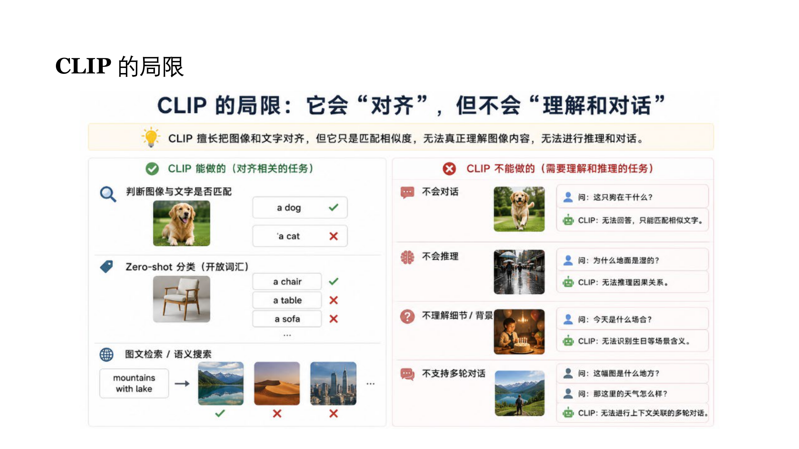

## 二、从对齐到对话

### Flamingo 的生成式方案

为了解决 CLIP 无法生成自由文本的问题，DeepMind 在 2022 年推出了 **Flamingo** 大模型。其设计理念可以被简洁地总结为：

$$\text{Flamingo} = \text{冻结的视觉编码器} + \text{冻结的自回归语言模型} + \text{可学习的交叉注意力层}$$

Flamingo 在原有的预训练语言模型（LM）的 Transformer 层之间，插入了特殊的 **Gated Cross-Attention（门控交叉注意力）** 模块。当图像信息经过视觉塔提取后，大模型在生成每一个词的自回归预测中，都会通过这个交叉注意力层去读取并关注视觉特征。这赋予了模型生成多模态交互式长文本的能力，并带来了杰出的上下文少样本学习表现。

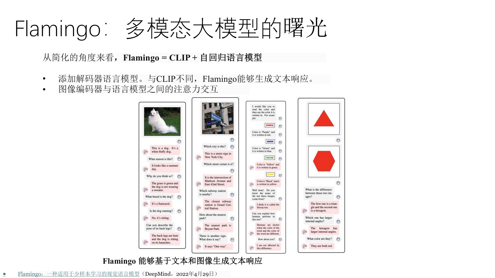

**交叉注意力和重采样**

Flamingo 的技术架构有两个关键支柱：
1. **Perceiver Resampler（感知重采样器）**：输入的图片可能有不同分辨率，提取的特征序列长度多变。Perceiver Resampler 通过交叉注意力投影，将任意长度的视觉特征转化为固定且精炼的视觉 Token 序列，极大地缩减了语言模型在注意力计算时的开销。
2. **冻结微调设计**：预训练视觉塔和自回归语言解码器在多模态联合学习期间都是被完全**冻结参数**的，仅有新添加的 Perceiver Resampler 和 Gated Cross-Attention 层接收梯度更新。这种低训练负载不仅保留了语言模型的通用语言表达精度，还赋予了其理解视觉的能力。

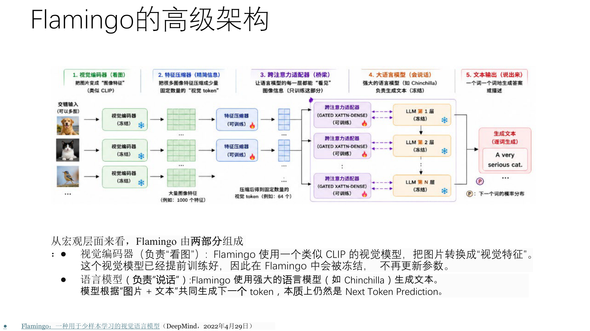

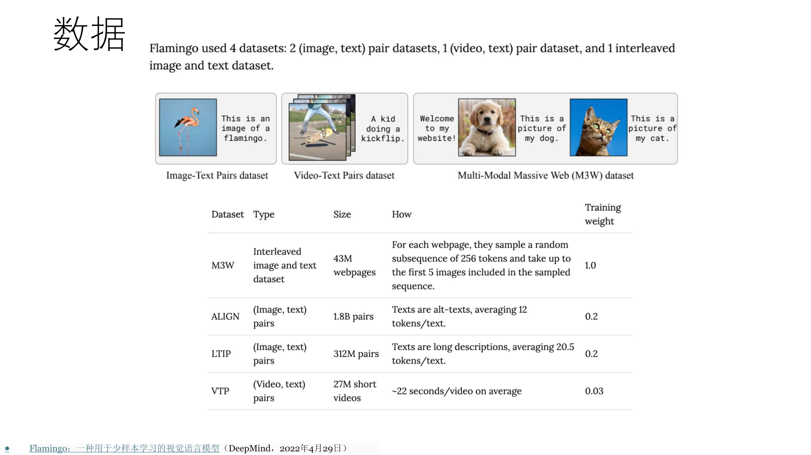

### LLaVA 与开源模型

**多模态指令微调**

指令微调（Instruction Tuning）在大模型向实用助手的蜕变中扮演了关键角色。为了将这一策略移植到多模态，我们必须构建海量的“看图 + 自然语言指令 $\rightarrow$ 详细答案”训练语料对。

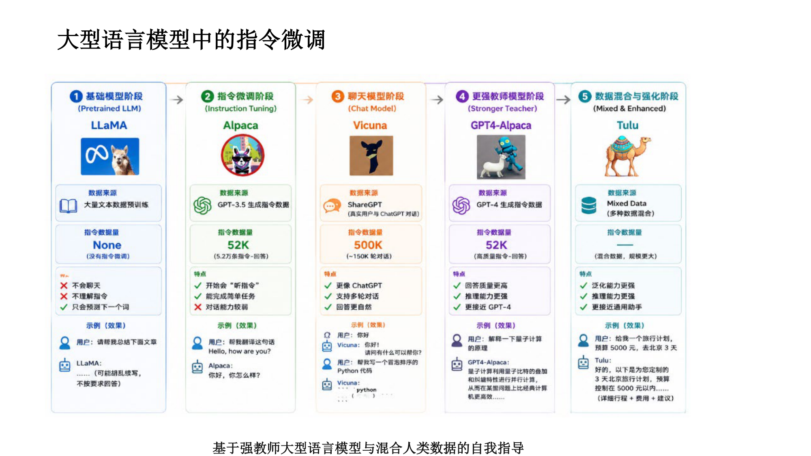

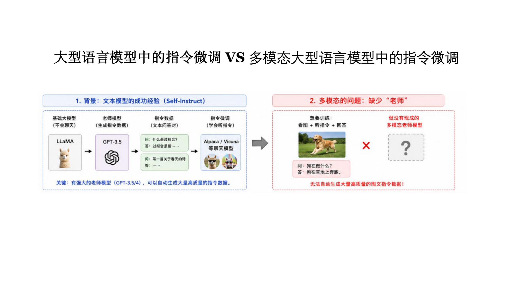

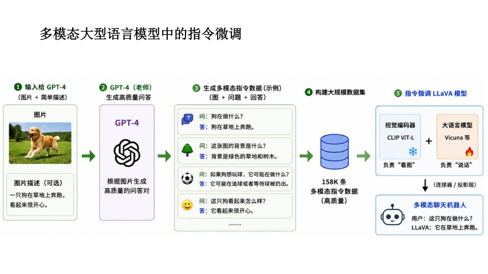

**LLaVA (Large Language and Vision Assistant)** 是这方面的开山之作。它舍弃了 Flamingo 的层间交叉注意力层，设计了一种更简单的轻量化连接器：
* 使用预训练的 CLIP ViT 作为视觉编码器。
* 利用一个**线性映射投影层（Projection Layer，或简单的 MLP）**，直接将图片特征转化为对应维度的 Token，像普通词向量一样与文本 Token 依次串联拼装，送入基座语言模型（如 Vicuna）中进行微调。

在多模态指令数据的生成上，LLaVA 提出了一种聪明的做法：将图像的文字描述（Captions）和目标物体框坐标（Bounding Boxes）作为上下文输入给纯文本的 GPT-4，由 GPT-4 自主脑补并模拟出包含多轮对话、详细图像描述和多步骤复杂逻辑推理的的高质量指令微调语料库，极大拉低了训练多模态助手的冷启动数据门槛。

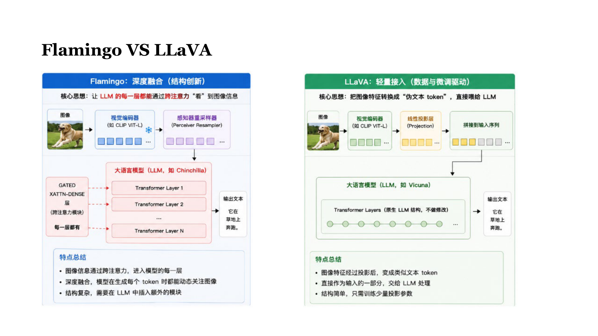

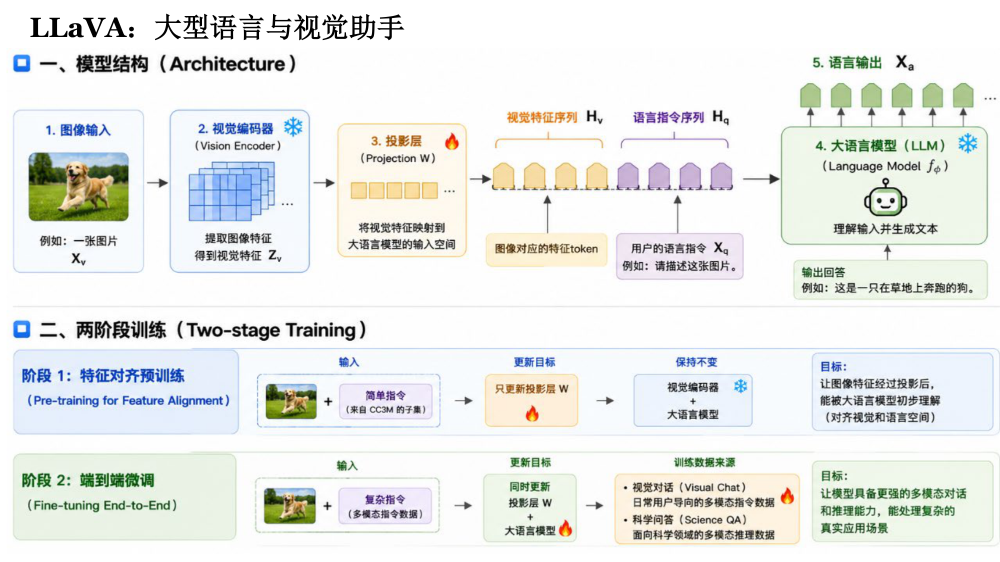

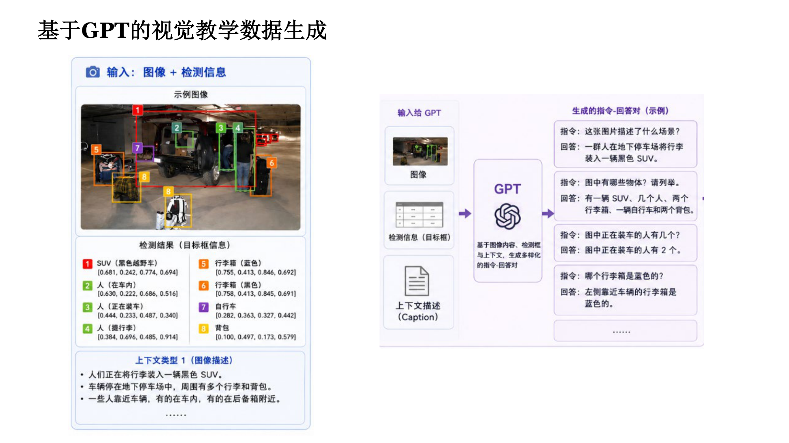

**Qwen-VL 与 CogVLM**

LLaVA 的极简映射策略引爆了开源多模态社区，演化出了多款主流的开源多模态大模型：
* **Qwen-VL**：引入了更大分辨率的视觉特征塔，并在训练语料中整合了大量的中英双语标注图表、OCR 识别语料，表现出极佳的多模态解析实用能力。

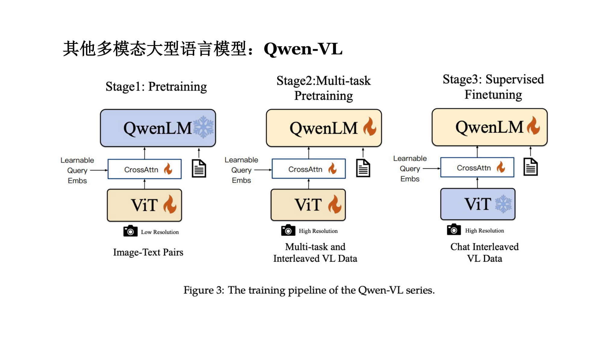

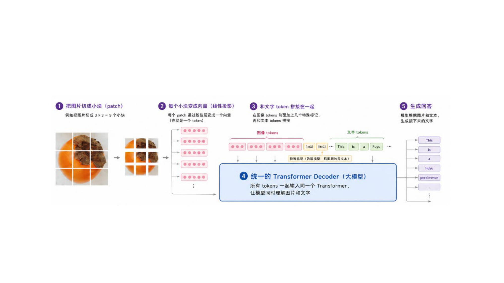

* **CogVLM**：为了解决投影映射层在深层 Transformer 运算中视觉信息容易被逐渐淡化和稀释的问题，CogVLM 在大模型的每一层内部，专门外接了一个独立的“**视觉专家模型 (Visual Expert)**”。这个视觉专家模型拥有与文本塔平行的 Key 和 Value 投影层，在自注意力矩阵运算中让视觉信息与文本进行深层次深度对齐，取得了行业领先的表现。

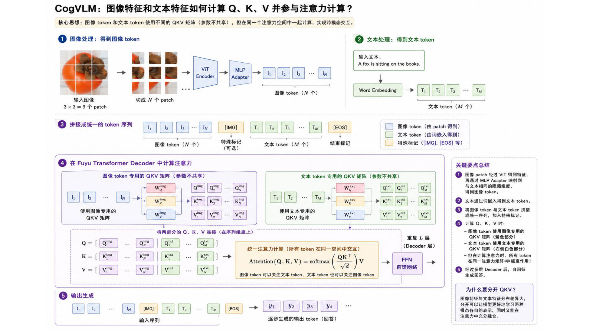

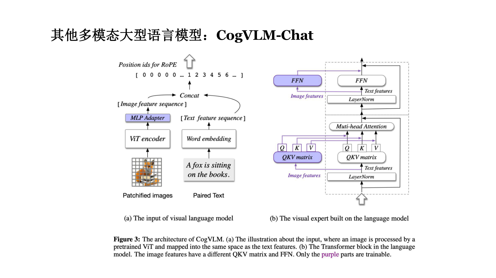

## 三、统一多模态模型

### GPT-4V 和 GPT-4o

作为工业界多模态大模型的标杆，**GPT-4V (GPT-4 with Vision)** 表现出了极其深厚的视觉特征建模和系统级缩放（Scaling）优势。相比开源生态，GPT-4V 能够支持极高分辨率图片的切片式无损阅读，且能同时读懂多图排布，对科学图表进行跨图逻辑检索和联合深度推理。

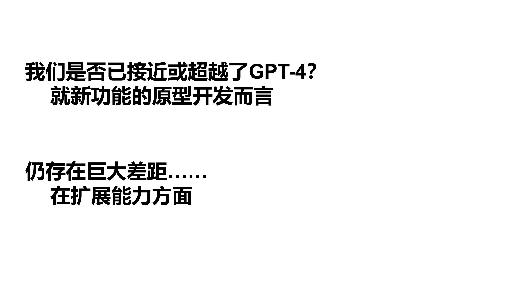

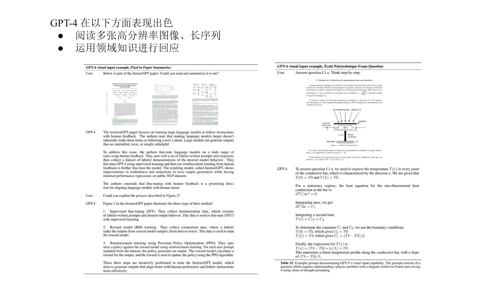

尽管架构未完全对外透露，但可以合理推断其利用了类似大规模交叉注意力的端到端融合策略，配以极大规模参数的语言主干和优质的长图文预训练数据。

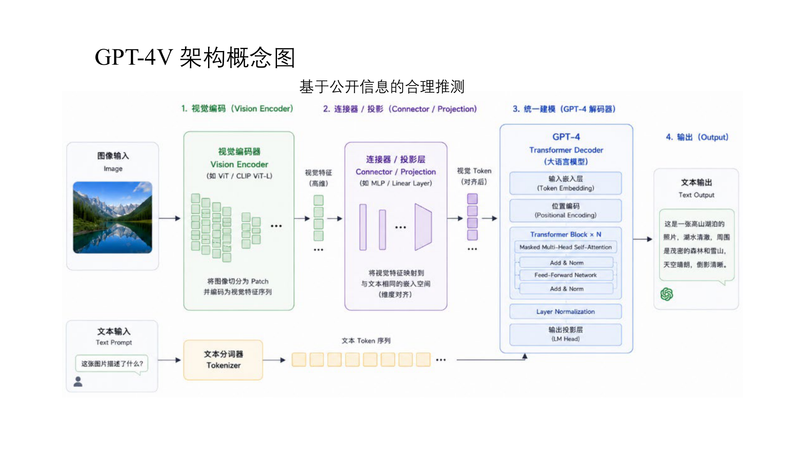

**GPT-4o 的统一输入输出**

在 2024 年，**GPT-4o (Omni)** 的发布颠覆了现存的模态融合方案。在之前的多模态大模型中，语音、图像与文本的连接大部分是通过“外挂不同的编码器/解码器进行拼接”完成的。而在 GPT-4o 中，OpenAI 实现并践行了**原生多模态统一神经网络**的设计（"same neural network"）：
* 所有文字、声音与视频的比特流（Tokens），都由**同一个神经网络**统一完成输入分词、中间特征转换与最后的多模态自回归接龙预测。

这种原生融合彻底消除了不同编码器中继投影引起的信息瓶颈与高额延迟，使系统能够实现极其自然的实时跨模态交互，并带来了无延迟的瞬时音视频推理反馈。

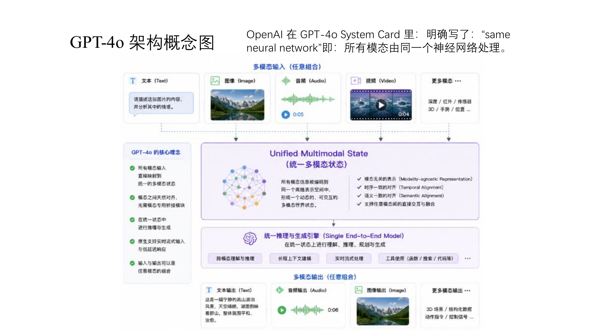

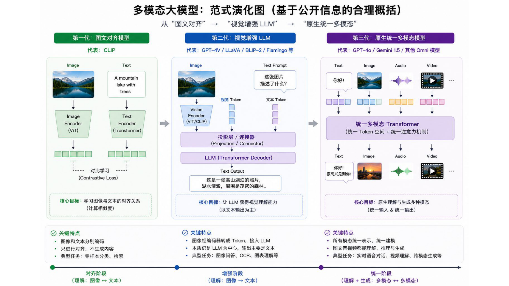

### 视觉推理的新方向

多模态推理的研究目前正在沿着两个方向纵深演进：
1. **视觉锚定与视觉思维链（Visual Grounding & Chain-of-Visual-Thought）**：例如 **Point-RFT** 方法引导模型在逻辑分析图片时，不仅输出结论，还必须在空间坐标上指明支撑该结论的图片局部的特定兴趣点（Thinking in Pointing），形成高度可解释的可视化思维链条。
2. **引导式视觉搜索与主动生成推理（V* / O3）**：在处理极为庞大的超高分辨率图像时，大模型引入“主动搜索”机制（Guided Visual Search），在第一遍草览图像后，由大脑自主决策对图像中的特定局部做局部超分或生成局部的重绘图，以获取更多的细节线索来支持后续推理。

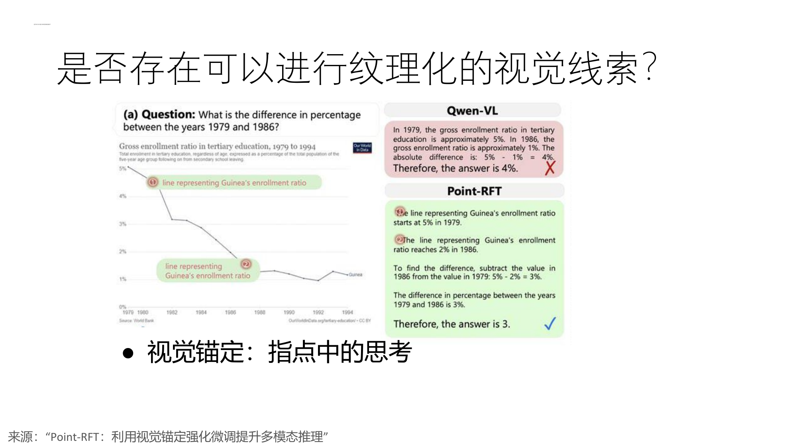

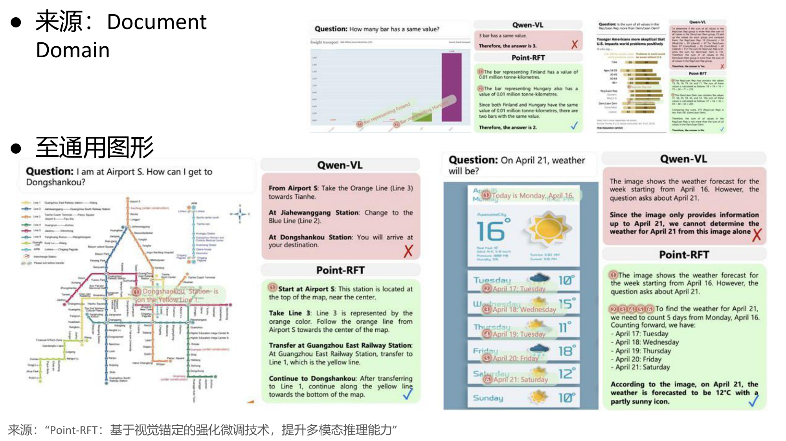

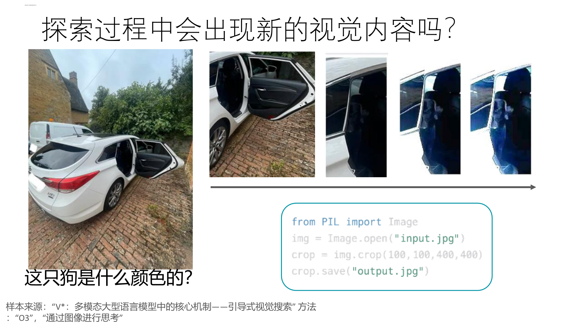

## 四、世界模型

### 从感知到模拟

多模态大模型的最终探索方向绝非止步于让大模型学会“看图说话”，而是要让其构建起关于真实物理世界的深刻理解——即构建**世界模型 (World Model)**。

所谓世界模型，是一个运行在 AI 内部的“物理世界模拟器”：
* 给定当前的世界景象（单张图像）和人类输入的控制动作，世界模型应该能够精确推演出在该动作施加之后，未来的世界场景状态将发生怎样自洽而合理的演化。

以 DeepMind 提出的 **Genie 3** 模型为例，该模型仅通过无监督的单视角视频训练，便能从单张静态图生成可以完全交互的 3D 虚拟场景，并预测用户在操控键盘输入不同动作后，虚拟场景的变化。

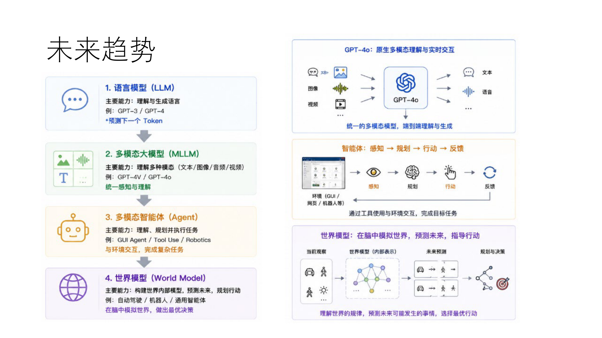

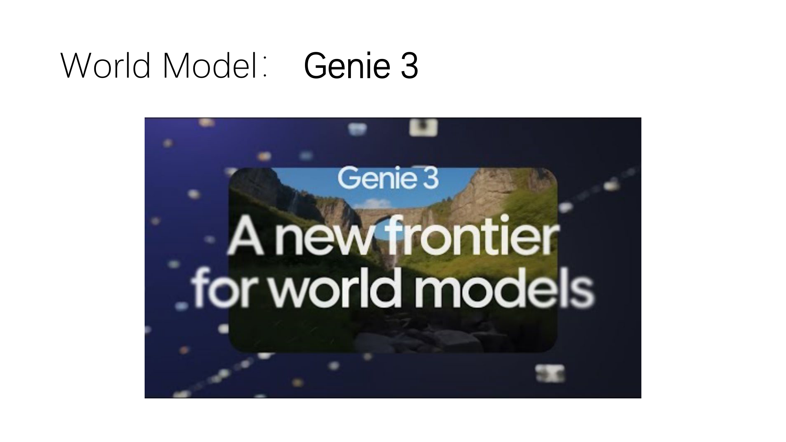

### 现状和挑战

然而，现存的世界模型还处于极度早期的萌芽阶段。我们可以总结当前的能力边界如下：

| 评估物理维度 | 已经达到的能力 | 尚不可逾越的鸿沟 |
|------|---------|-----------|
| **空间稳定性** | 能够维持局部的三维空间视觉连续性 | 长期或大空间维度的场景模拟会崩塌 |
| **物理规律模拟** | 能还原短时视频内的重力下降、碰撞碎裂等视觉规律 | 缺乏对深层守恒定律和力学因果的底层理解 |
| **生成机制** | 依靠生成概率生成看似合理的连续视频帧 | 难以保证绝对的因果链条对齐 |
| **推理规划** | 具有基础的即时视觉避障推理 | 无法支持文明级别的长程推理规划 |

当前世界模型最大的挑战在于：如何**从“统计上的相似联想”跨越到“因果物理的底层推演”**。目前大模型之所以能表现出世界规律，主要是因为拟合了海量视频中的像素跳转概率，而没有真正建立起物理实体间相互作用的因果认知。

从最开始的 **CLIP 对齐**，到 **Flamingo 对话**，再到 **LLaVA 指令进化**与 **GPT-4o 模态大一统**，AI 的演进正朝着对物理世界的真实感知的目标迈进。这条路线的终极彼岸将是**具身智能 (Embodied AI)**——一个能真正理解真实世界物理运动规律，并能在其中独立进行推理、规划和执行操作的通用大一统智能实体。

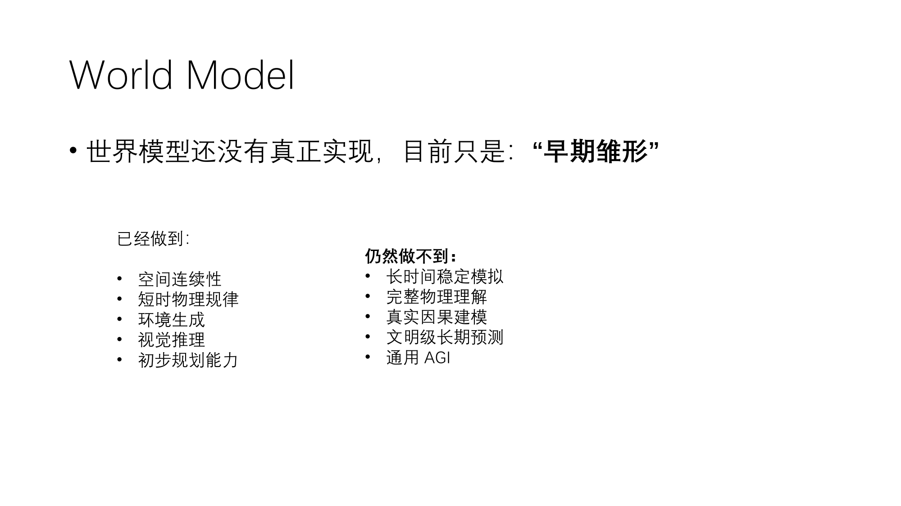

